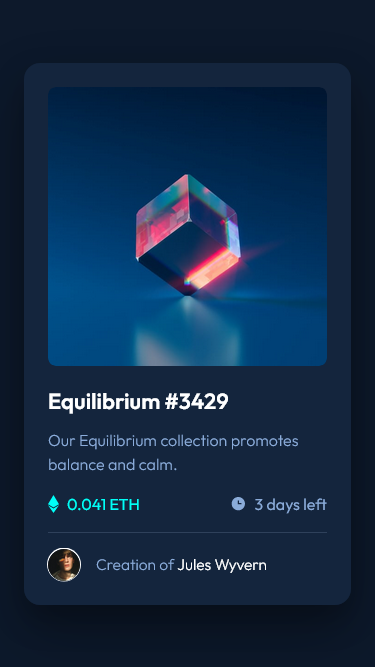
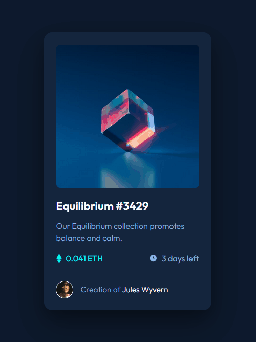

# Frontend Mentor - Interactive rating component solution

This is a solution to the [NFT preview card component challenge on Frontend Mentor](https://www.frontendmentor.io/challenges/nft-preview-card-component-SbdUL_w0U). Frontend Mentor challenges help you improve your coding skills by building realistic projects.

## Overview

### The challenge

Users should be able to:

- View the optimal layout depending on their device's screen size
- See hover states for interactive elements

### Links

- [Solution on Frontend Mentor]()
- [Live Site on GitHub Pages]()

### Screenshots

|                        Screenshot                         |     |                                     Demonstration                                      |
| :-------------------------------------------------------: | :-: | :------------------------------------------------------------------------------------: |
|  |     |  |

## My process

### What I learned

In this project, I have practiced the following skills:

- Creating a responsive component with **semantic HTML**, **CSS** and **JavaScript**
- Using the **`<dialog>` element** and **JavaScript** to create a modal
- **Styling scrollbars** in Firefox, Chrome and Safari
- Detecting if a device supports hovering with the `@media (hover: hover)` media query
- Using **CSS relative units** to ensure the page scales according to the user's font size settings
- Using **CSS custom properties** to allow easy customization and reusability of components
- Using **Git** and **GitHub**

---

### Continued development

To further develop this project, I would like to use a polyfill to ensure a great experience for older browsers that might not support the `<dialog>` element. As of September 27, 2022, [the `<dialog>` element is supported by 92.18% of browsers in use globally](https://caniuse.com/dialog).

### Useful resources

- [_Accessible Modal Dialogs -- A11ycasts #19_ (Rob Dodson)](https://www.youtube.com/watch?v=JS68faEUduk) - A great video showing everything that must be considered when creating an accessible modal dialog.
- [_dialog = the easiest way to make a popup modal_ (Kevin Powell)](https://www.youtube.com/watch?v=TAB_v6yBXIE) - This video introduced the `<dialog>` element to me, and it has a concise tutorial on how to implement and style it.
- [_The Current State of Styling Scrollbars in CSS (2022 Update)_ (Chris Coyier)](https://css-tricks.com/the-current-state-of-styling-scrollbars-in-css/) - This article was useful to learn how to style scrollbars in different browsers.

## Author

- Twitter - [@JulioCinquina](https://twitter.com/JulioCinquina)
- Frontend Mentor - [@JulioCinquina](https://www.frontendmentor.io/profile/JulioCinquina)
